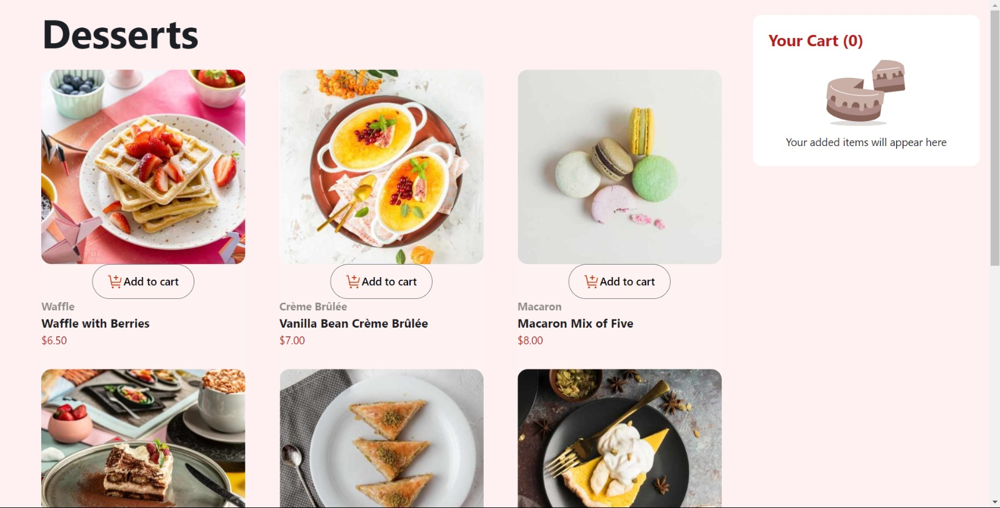
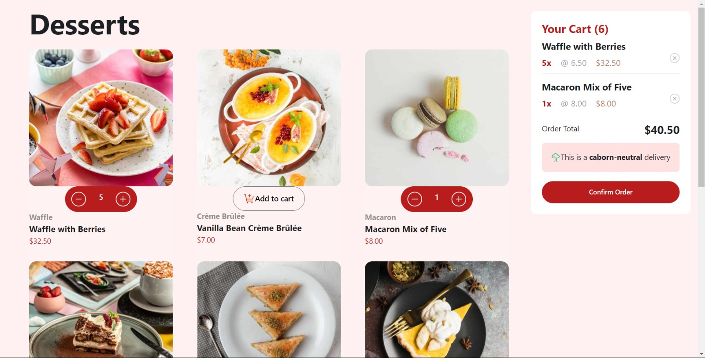
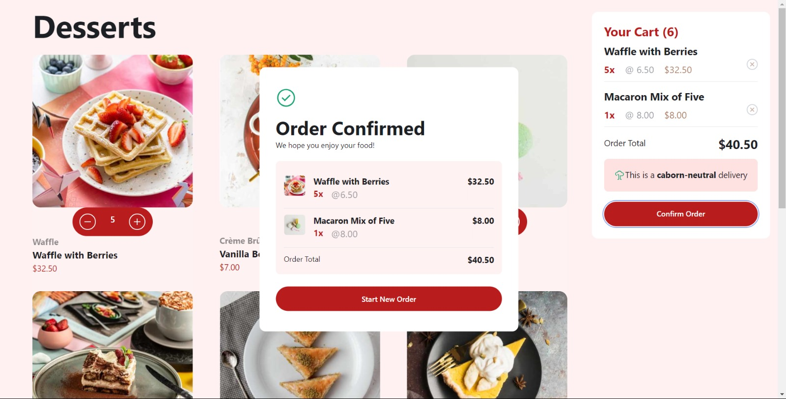

[JAVASCRIPT__BADGE]: https://img.shields.io/badge/Javascript-000?style=for-the-badge&logo=javascript
[TYPESCRIPT__BADGE]: https://img.shields.io/badge/typescript-D4FAFF?style=for-the-badge&logo=typescript
[REACT__BADGE]: https://img.shields.io/badge/React-005CFE?style=for-the-badge&logo=react
[TailwindCSS]: https://img.shields.io/badge/TailwindCSS-%2306B6D4.svg?style=for-the-badge&logo=tailwindcss&logoColor=white
[PROJECT__BADGE]: https://img.shields.io/badge/📱Visit_this_project-000?style=for-the-badge&logo=project
[PROJECT__URL]: https://github.com/Coe-Everton/product-list-wih-cart

<h1 align="center" style="font-weight: bold;">Product List With Cart 🛒</h1>

![react][REACT__BADGE]
![javascript][JAVASCRIPT__BADGE]
![tailwindsCSS][TailwindCSS]


<p align="center">
 <a href="#about">About</a> • 
 <a href="#started">Getting Started</a> • 
  <a href="#started">App Routes</a> • 
  <a href="#colab">Collaborators</a> •
 <a href="#contribute">Contribute</a>
</p>


<p align="center">
    
    
    
</p>

<h2 id="started">📌 About</h2>

Nesses projeto construir um lista de produtos que podem ser adicionada a carrinho e ser feita a confirmação dos produtos, tal projeto foi proposto pelo site Frontendmentor.com

[![project][PROJECT__BADGE]][PROJECT__URL]

<h2 id="started">🚀 Getting started</h2>

- Criar dois terminais, um para criação da API e outra para rodar o Front
- Em um dos terminais dê cd public/ e em seguida dê npx json-server data.json (Obs: não esqueça de baiar o Json-server)
- No outro terminal no cd product-list-with-cart/ dê npm run dev

<h3>Prerequisites</h3>

- [Visual Studio Code](https://code.visualstudio.com/)
- [NodeJS](https://nodejs.org/pt)
- [Git](https://github.com)

<h3>Cloning</h3>

```bash
git clone https://github.com/Coe-Everton/product-list-wih-cart.git
```

<h3>Starting</h3>

```bash
cd product-list-wih-cart/
npx json-server product-list-wih-cart/public/data.json
npm run dev
```

<h2 id="routes">📍 Application Routes</h2>


| route               | description                                          
|----------------------|-----------------------------------------------------
| <kbd>/</kbd>     | 0-8 possue objetos com todas as informações dos produtos 

<h2 id="colab">🤝 Collaborators</h2>

<table>
  <tr>
    <td align="center">
      <a href="#">
        <br>
        <sub>
          <b>Everton Caldeira Oliveira</b>
        </sub>
      </a>
    </td>
  </tr>
</table>
